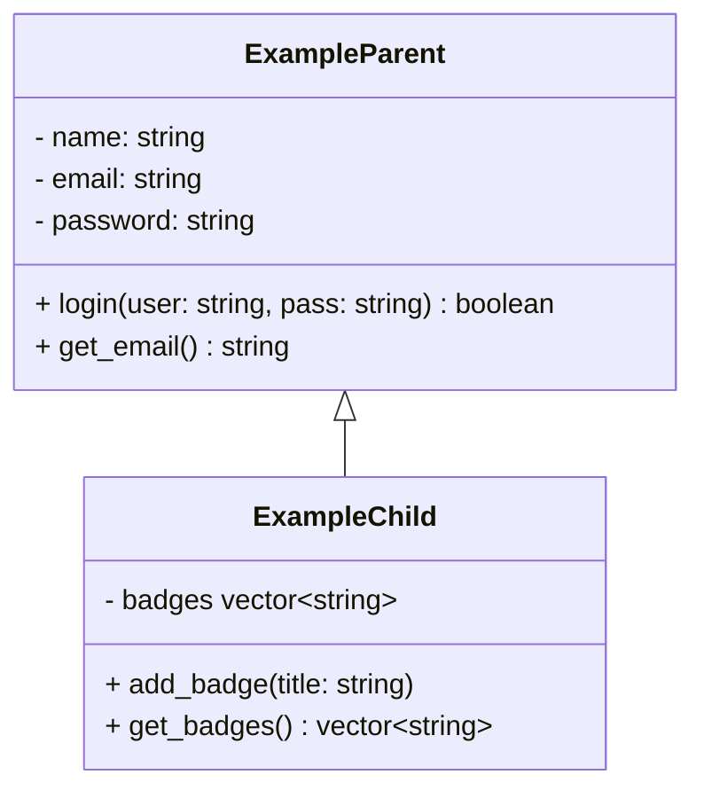

# tippitytappity-design

tippitytappity is a program to practice typing


## Data model


## Data model 2

```mermaid
classDiagram 
      TypeCoach <|-- TypeStudent   
      class TypeCoach{
            -id: string
            +create_lesson()string
      }
      class TypeStudent{
            -name: string
            -email: string
            -level: integer
            -problem_keys: string
            + get_email() string
      }
      
