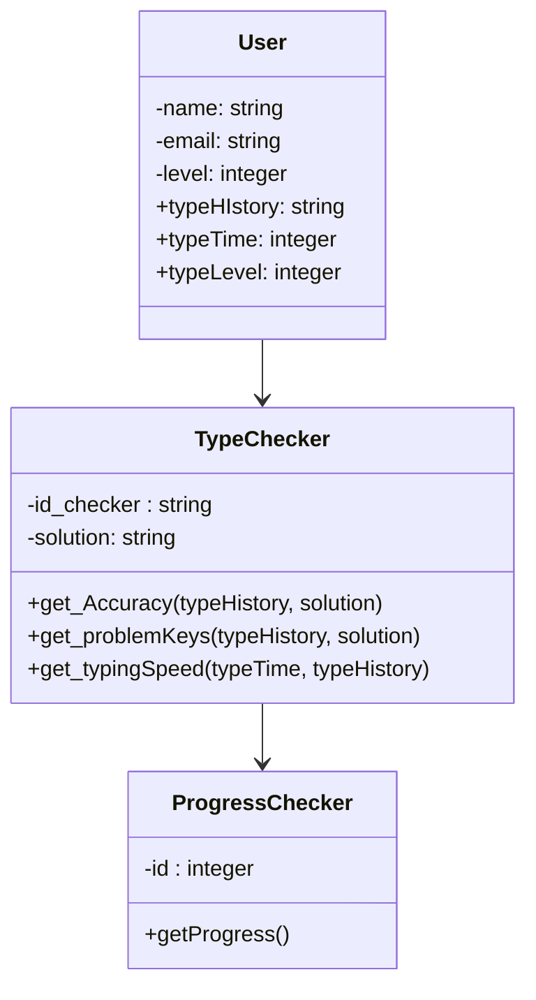

# tippitytappity-design

tippitytappity is a program to practice typing

## Data model 2 Revision

It keeps a history of each typing test the user attempts including the results (both accuracy and speed)
Supports multiple users, with history for each user to monitor their progress over time

